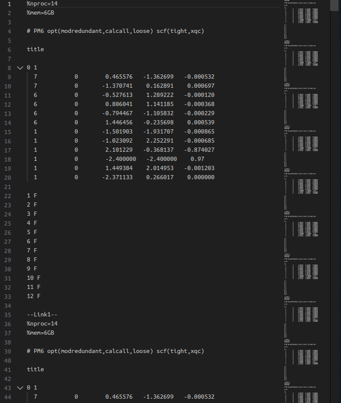

# scan_gen

根据指定格式生成批量任务文件。

## 目的

为用于生成 `Gaussian` 批量任务设计。

## 功能说明

根据文件中指定的格式，对形如 `[$n]` 的字符串按一定规则替换。  
具体请见 使用演示 。


## 实例演示

### 输入文件

```
%nproc=14
%mem=6GB

# PM6 opt(modredundant,calcall,loose) scf(tight,xqc)

title

0 1
  7           0        0.465576   -1.362699   -0.000532
  7           0       -1.370741    0.162891    0.000697
  6           0       -0.527613    1.289222   -0.000120
  6           0        0.806041    1.141185   -0.000368
  6           0       -0.794467   -1.105832   -0.000229
  6           0        1.446456   -0.235698    0.000539
  1           0       -1.501903   -1.931707   -0.000865
  1           0       -1.023092    2.252291   -0.000685
  1           0        2.101229   -0.368137   -0.874027
  1           0        [$1]   [$2]    0.97
  1           0        1.449384    2.014953   -0.001203
  1           0       -2.371133    0.266017    0.000000

1 F
2 F
3 F
4 F
5 F
6 F
7 F
8 F
9 F
10 F
11 F
12 F

--Link1--

```

### 操作

```
Enter input filepath: scan_org.gjf
Found max(n)=2.
Please enter the `Start` `Step` `End`, `End` should be a bit 'larger'. 
[$1]:-2.4 0.4 2.41
[$2]:-2.4 0.4 2.41
Enter output filepath: out.gjf
```

### 输出文件




## 使用说明


### 编译构建

以 `GNU/Linux` 环境为例。

```bash
./build.sh
```

`Windows` 执行 `build.bat`。功能未经测试。  

编译所得程序位于 `build` 文件夹中。

### 输入文件编写

#### 简单的例子

在与程序同目录下，创建 `a.txt` 文件

```
[$1] [$2]
---

```
执行程序：
```bash
./scan_gen
```
```
Enter input filepath: a.txt
Found max(n)=2.
Please enter the `Start` `Step` `End`, `End` should be a bit 'larger'. 
[$1]:1 1 3.1 
[$2]:13 -1 10.9
Enter output filepath: b.txt
```
查看输出文件 `b.txt` ，内容为：
```
1.000000 13.000000
---
2.000000 13.000000
---
3.000000 13.000000
---
1.000000 12.000000
---
2.000000 12.000000
---
3.000000 12.000000
---
1.000000 11.000000
---
2.000000 11.000000
---
3.000000 11.000000
---

```

---

#### 略复杂的例子

在与程序同目录下，创建 `input.txt` 文件

```
01- [$1] [$2] [$3] -01
02- [$1] [$1] [$1] -02
aa [$3] bb [$1] cc

----

```

执行程序：
```bash
./scan_gen
```

```
Enter input filepath: input.txt
Found max(n)=3.
Please enter the `Start` `Step` `End`, `End` should be a bit 'larger'. 
[$1]:1 2 3.1
[$2]:2 0.2 2.5
[$3]:1 0.1 1.11
Enter output filepath: out.txt
```
查看输出文件 `out.txt` ，内容为：

```
01- 1.000000 2.000000 1.000000 -01
02- 1.000000 1.000000 1.000000 -02
aa 1.000000 bb 1.000000 cc

----
01- 3.000000 2.000000 1.000000 -01
02- 3.000000 3.000000 3.000000 -02
aa 1.000000 bb 3.000000 cc

----
01- 1.000000 2.200000 1.000000 -01
02- 1.000000 1.000000 1.000000 -02
aa 1.000000 bb 1.000000 cc

----
01- 3.000000 2.200000 1.000000 -01
02- 3.000000 3.000000 3.000000 -02
aa 1.000000 bb 3.000000 cc

----
01- 1.000000 2.400000 1.000000 -01
02- 1.000000 1.000000 1.000000 -02
aa 1.000000 bb 1.000000 cc

----
01- 3.000000 2.400000 1.000000 -01
02- 3.000000 3.000000 3.000000 -02
aa 1.000000 bb 3.000000 cc

----
01- 1.000000 2.000000 1.100000 -01
02- 1.000000 1.000000 1.000000 -02
aa 1.100000 bb 1.000000 cc

----
01- 3.000000 2.000000 1.100000 -01
02- 3.000000 3.000000 3.000000 -02
aa 1.100000 bb 3.000000 cc

----
01- 1.000000 2.200000 1.100000 -01
02- 1.000000 1.000000 1.000000 -02
aa 1.100000 bb 1.000000 cc

----
01- 3.000000 2.200000 1.100000 -01
02- 3.000000 3.000000 3.000000 -02
aa 1.100000 bb 3.000000 cc

----
01- 1.000000 2.400000 1.100000 -01
02- 1.000000 1.000000 1.000000 -02
aa 1.100000 bb 1.000000 cc

----
01- 3.000000 2.400000 1.100000 -01
02- 3.000000 3.000000 3.000000 -02
aa 1.100000 bb 3.000000 cc

----

```
